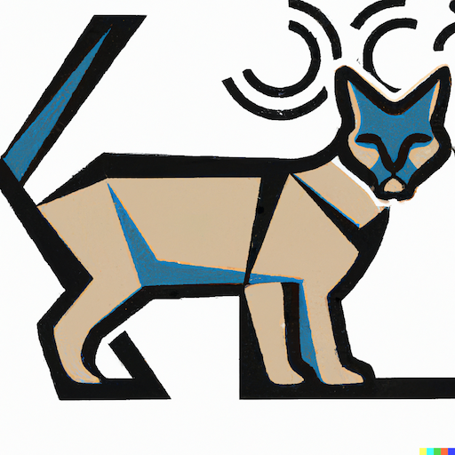

# Caracal

### Caracal is a library and platform for managing a decentralized, BitTorrent-based social network.

### This project is still majorly under constuction, but I'm making it public for posterity's sake.

### Users should be able to...
- Post
- Pack post into an encrypted file, and post magnet link to repo.
- View posts, aggregating saved posts and checking for/downloading new ones.
- Add friends by exchanging keys.

# Update 5/23
I've decided to retire this project for the most part as my interests have moved to other things,
and I was beginning to feel like instead of making my own library, I was just doing a lot of work
to wrap LibTorrent while not contributing too much of my own. It still was a great opportunity to 
get into the C++ ecosystem and I learned a lot.
